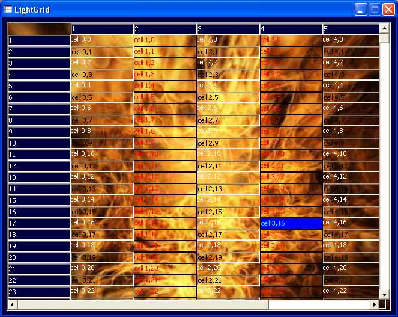



## LightGrid

### Description

Lightgrid is a little(45 KB) replacement for the big FlexGridControl (240 KB).

It hasn't all the features like the FlexGrid, but it has a great features, like BackgroundPicture, transparent cells, you can draw on the Backgournd like on a PictureBox, and so on.

It's good for these people who didn't want a 240 KB big Control and didn't want to use such a big grid like in Excel, because it's not really fast if you use many cells.

I've commented in german and english. So try it out and see if you can need it and if you find it good, then please vote.
 
### More Info
 

             |
---                |---
**Submitted On**   |1998-04-24 00:00:00
**By**             |[Frank Maier](https://github.com/Planet-Source-Code/PSCIndex/blob/master/ByAuthor/frank-maier.md)
**Level**          |Beginner
**User Rating**    |4.3 (13 globes from 3 users)
**Compatibility**  |VB 5\.0, VB 6\.0
**Category**       |[Custom Controls/ Forms/  Menus](https://github.com/Planet-Source-Code/PSCIndex/blob/master/ByCategory/custom-controls-forms-menus__1-4.md)
**World**          |[Visual Basic](https://github.com/Planet-Source-Code/PSCIndex/blob/master/ByWorld/visual-basic.md)
**Archive File**   |[LightGrid1621727302003\.zip](https://github.com/Planet-Source-Code/frank-maier-lightgrid__1-47266/archive/master.zip)

